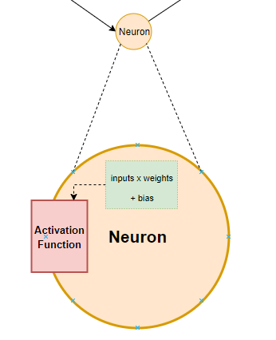
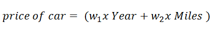
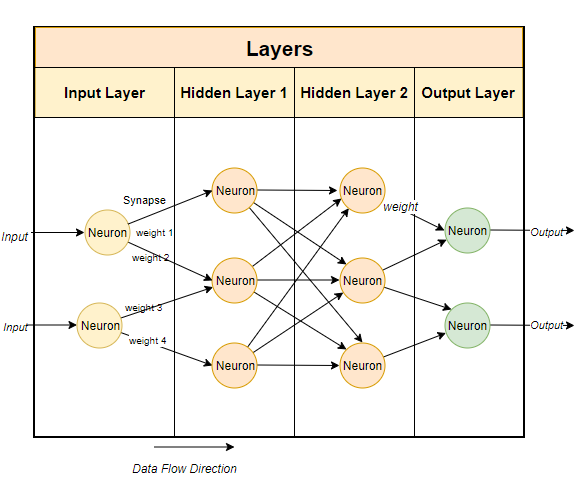

# Foundation of Deep Learning
## Basics
> Artificial Neural Networks Are Inspired By Biological Neural Networks

* Biological neuron vs ANN
<p align="center">
  
</p>

* Just like biological neural network, artificial neural network is constantly learning and updating its knowledge and understanding of the environment based on experiences that it encountered.
* each input node can be any numerical value i.e. real no., can be +ve or -ve, whole or decimal nos.
* weight can be any real no.
* weighted sum is the input of activation function
```
f(sum(Xi * Wi))
```
* Components of neural network
	- Bias & Weights
	- Hidden layer
	- Activation function
	- Neurons

### Bias and Weights
#### Weight
* When the inputs are transmitted between neurons, the weights are applied to the inputs and passed into an activation function along with the bias.
* weight is represented as synapse (a structure that permits a neuron (or nerve cell) to pass an electrical or chemical signal to another neuron or to the target) in neural network.
* Weights are the co-efficients of the equation which you are trying to resolve. Negative weights reduce the value of an output.
* When a neural network is trained on the training set, it is initialised with a set of weights. These weights are then optimised during the training period and the optimum weights are produced.
* A neuron is detailed as:
<p align="center">
  
</p>
* The computed value is fed into the activation function, which then prepares an output:
<p align="center">
  
</p>

> Think of the activation function as a mathematical function that can normalise the inputs.

* Example: Predict the price of car
	- features/parameters (Xi)
		+ manufacturing year
		+ distance travelled
	- price of car
<p align="left">
  
</p>
	- The weights are essentially reflecting how important an input is.
		+ w1 -> positive. As the car is manufactured latest, more is the price.
		+ w2 -> negative. As the car is travelled more, less is the price.


#### Bias
* Bias is simply a constant value (or a constant vector) that is added to the product of inputs and weights. 
* Bias is utilised to offset the result.
* The bias is used to shift the result of activation function towards the positive or negative side.
* Imagine a situation where the intended output is 2 where the weighted sum is 0. Here, the bias is to be set as 2. So, if we do not include the bias, then the neural network is simply performing a matrix multiplication on the inputs and weights. This can easily end up over-fitting the data set.
* Bias is essentially the negative of the threshold, therefore the value of bias controls when to activate the activation function.

> The addition of bias reduces the variance and hence introduces flexibility and better generlisation to the neural network.

### Hidden layer
* A neural network looks like this:
<p align="center">
  
</p>
* located b/w input & output
* where the function applies weights to the inputs and directs them through an activation function as the output.
* perform non-linear transformations of the inputs.
* Hidden layer(s) can vary (no. & each containing no. of neurons), depending on 
	- the purpose/objective of the neural network.
	- associated weights
* hidden layers in simple vs deep neural network
<p align="center">
  
</p>
* Hidden layers consist of activation function(s) which are mathematical & the intended output is between 0 & 1, the range for defining probability.
* Hidden layers can be separated by their functional characteristics. Hidden layers allow for the function of a neural network to be broken down into specific transformations of the data. Each hidden layer function is specialized to produce a defined output. E.g. Suppose a hidden layer is determined for eye and then an another hidden layer for ear. Now, the hidden layers determined for ear & eye may be used in conjunction to determine face.

### Activation function
* Most popular activation functions are __Sigmoid__, __Hyperbolic tangent__, __ReLU__.
* Sigmoid function
<p align="center">
  
</p>

* rectified linear activation function or __ReLU__ for short is a piecewise linear function that will output the input directly if it is positive, otherwise, it will output zero. It has become the default activation function for many types of neural networks because a model that uses it is easier to train and often achieves better performance. There are more reasons:
	- As the sigmoid & hyperbolic tangent functions have "vanishing gradient problem", which is not there in ReLU.
* ReLU is the default activation in case of multilayer perceptron & CNNs.


### Data flow direction
* the neural network looks like this:
<p align="center">
  
</p>
* layers
	- 1 input layer
	- 2 hidden layers
	- 1 output layer
* Here, no. of neurons
	- 2 (input layer)
	- 6 (3 per hidden layer)
	- 2 (output layer)
* Each neuron connected through synapses.
* Each neuron has one or more inputs along with weights & biases. An activation function is applied to convert the input to the required output.

## Application
* Neural networks can help us understand relationships between complex data structures. The neural networks can use the trained knowledge to make predictions on the behavior of the complex structures.
* Neural networks can be utilised to predict linear and non-linear relationships in data.
* Neural networks can process images and even make complex decisions such as on how to drive a car, or which financial trade to execute next.

## Cons
* Although this is subjective but people have had hard time convincing business how neural networks have produced the answers. Hence the business users are slightly reluctant to trust its reasoning when compared to simple models like random forests and regression.
* Although, neural networks can be sophisticated and can solve complex problems, they are slower than most machine algorithms. They can also end up over-fitting the training data.

## References
* https://www.datacamp.com/community/tutorials/deep-learning-python
* [sigmoid unit in neural networks](https://www.youtube.com/watch?v=9IwbALQ9kdY)
* [A Gentle Introduction to the Rectified Linear Unit (ReLU)](https://machinelearningmastery.com/rectified-linear-activation-function-for-deep-learning-neural-networks/)
* [Activation Functions in Neural Networks](https://towardsdatascience.com/activation-functions-neural-networks-1cbd9f8d91d6)
* [What is hidden layer](https://deepai.org/machine-learning-glossary-and-terms/hidden-layer-machine-learning)
* [Understanding neural networks](https://medium.com/fintechexplained/understanding-neural-networks-98e94251fb97)
* [Bias and Weights](https://medium.com/fintechexplained/neural-networks-bias-and-weights-10b53e6285da)
* [Neural Network Neurons](https://medium.com/fintechexplained/neural-network-layers-75e48d71f392)
* [Understanding Neural Network Neurons](https://medium.com/fintechexplained/understanding-neural-network-neurons-55e0ddfa87c6)