# Foundation of Deep Learning
## Theory
> Artificial Neural Networks Are Inspired By Biological Neural Networks

* Biological neuron vs ANN
<p align="center">
  
</p>

* Just like biological neural network, artificial neural network is constantly learning and updating its knowledge and understanding of the environment based on experiences that it encountered.
* each input node can be any numerical value i.e. real no., can be +ve or -ve, whole or decimal nos.
* weight can be any real no.
* weighted sum is the input of activation function
```
f(sum(Xi * Wi))
```
* Layers of neural network
	- input
	- hidden
	- output
* Components of neural network
	- Bias & Weights
	- Hidden layer
	- Activation function
	- Neurons

### Bias and Weights
#### Weight
* When the inputs are transmitted between neurons, the weights are applied to the inputs and passed into an activation function along with the bias.
* weight is represented as synapse (a structure that permits a neuron (or nerve cell) to pass an electrical or chemical signal to another neuron or to the target) in neural network.
* Weights are the co-efficients of the equation which you are trying to resolve. Negative weights reduce the value of an output.
* When a neural network is trained on the training set, it is initialised with a set of weights. These weights are then optimised during the training period and the optimum weights are produced.
* A neuron is detailed as:
<p align="center">
  
</p>
* The computed value is fed into the activation function, which then prepares an output:
<p align="center">
  
</p>

> Think of the activation function as a mathematical function that can normalise the inputs.

* Example: Predict the price of car
	- features/parameters (Xi)
		+ manufacturing year
		+ distance travelled
	- price of car
<p align="left">
  
</p>
	- The weights are essentially reflecting how important an input is.
		+ w1 -> positive. As the car is manufactured latest, more is the price.
		+ w2 -> negative. As the car is travelled more, less is the price.


#### Bias
* Bias is simply a constant value (or a constant vector) that is added to the product of inputs and weights. 
* Bias is utilised to offset the result.
* The bias is used to shift the result of activation function towards the positive or negative side.
* Imagine a situation where the intended output is 2 where the weighted sum is 0. Here, the bias is to be set as 2. So, if we do not include the bias, then the neural network is simply performing a matrix multiplication on the inputs and weights. This can easily end up over-fitting the data set.
* Bias is essentially the negative of the threshold, therefore the value of bias controls when to activate the activation function or neurons (bias is defined for each neuron, also entire hidden layer(multiple neurons)).

> The addition of bias reduces the variance and hence introduces flexibility and better generalisation to the neural network.

* Bias is called as "bias nodes", "bias neurons", "bias units" within a neural network.
* when we talk about bias, we’re talking about it on a per-neuron basis. We can think of each neuron as having its own bias term, and so the entire network will be made up of multiple biases.
* the values assigned to these biases are learnable, just like the weights. E.g. stochastic gradient descent (SGD) updates the weights via backpropagation during training and it also learns & updates the biases as well.
* Bias_of_neuron plays the role of a threshold, which determines whether or not the activation o/p from a neuron is propagated forward through the network.
* Bias_of_neuron determines whether or not or by how much a neuron will fire.
* Bias_of_neuron is defined as:
```
f(weighted sum of inputs + Bias)

where, f -> activation function
			Bias -> Bias of a neuron
```  
* For Example, refer [here...in the end](https://deeplizard.com/learn/video/HetFihsXSys)

#### Conclusion
* Just as we don’t explicitly choose and control the weights in a network, we don’t explicitly choose and control the biases either.
* Remember, the biases are learnable parameters within the network, just like weights. After the biases are initialized, with random numbers, or zeros, or really any other value, they will be updated during training, allowing our model to learn when to activate and when not to activate each neuron.


### Hidden layer
* A neural network looks like this:
<p align="center">
  
</p>
* located b/w input & output
* where the function applies weights to the inputs and directs them through an activation function as the output.
* perform non-linear transformations of the inputs.
* Hidden layer(s) can vary (no. & each containing no. of neurons), depending on 
	- the purpose/objective of the neural network.
	- associated weights
* hidden layers in simple vs deep neural network
<p align="center">
  
</p>
* Hidden layers consist of activation function(s) which are mathematical & the intended output is between 0 & 1, the range for defining probability.
* Hidden layers can be separated by their functional characteristics. Hidden layers allow for the function of a neural network to be broken down into specific transformations of the data. Each hidden layer function is specialized to produce a defined output. E.g. Suppose a hidden layer is determined for eye and then an another hidden layer for ear. Now, the hidden layers determined for ear & eye may be used in conjunction to determine face.

### Activation function
* Most popular activation functions are __Sigmoid__, __Hyperbolic tangent__, __ReLU__.
* Sigmoid function
<p align="center">
  
</p>

* rectified linear activation function or __ReLU__ for short is a piecewise linear function that will output the input directly if it is positive, otherwise, it will output zero. It has become the default activation function for many types of neural networks because a model that uses it is easier to train and often achieves better performance. There are more reasons:
	- As the sigmoid & hyperbolic tangent functions have "vanishing gradient problem", which is not there in ReLU.
* ReLU is the default activation in case of multilayer perceptron & CNNs.


### Neuron
* the neural network looks like this:
<p align="center">
  
</p>
* layers
	- 1 input layer
	- 2 hidden layers
	- 1 output layer
* Here, no. of neurons
	- 2 (input layer)
	- 6 (3 per hidden layer)
	- 2 (output layer)
* Each neuron connected through synapses.
* Each neuron has one or more inputs along with weights & biases. An activation function is applied to convert the input to the required output.

## Application
* Neural networks can help us understand relationships between complex data structures. The neural networks can use the trained knowledge to make predictions on the behavior of the complex structures.
* Neural networks can be utilised to predict linear and non-linear relationships in data.
* Neural networks can process images and even make complex decisions such as on how to drive a car, or which financial trade to execute next.

## Cons
* Although this is subjective but people have had hard time convincing business how neural networks have produced the answers. Hence the business users are slightly reluctant to trust its reasoning when compared to simple models like random forests and regression.
* Although, neural networks can be sophisticated and can solve complex problems, they are slower than most machine algorithms. They can also end up over-fitting the training data.

## How Many Hidden Layers/Neurons to Use in Artificial Neural Networks?
* Frequent questions asked:
	- What is the number of hidden layers to use?
	- How many hidden neurons in each hidden layer?
	- What is the purpose of using hidden layers/neurons?
	- Is increasing the number of hidden layers/neurons always gives better results?
* Knowing the number of input and output layers and the number of their neurons is the easiest part.
* Every network has a single input layer and a single output layer.
* The number of neurons in the input layer equals the number of input variables in the data being processed.
* The number of neurons in the output layer equals the number of outputs associated with each input.
* The challenge is in knowing the no. of hidden layers. Here is the guide:
	- Based on the data, draw an expected decision boundary to separate the classes.
	- Express the decision boundary as a set of lines. Note that the combination of such lines must yield to the decision boundary.
	- The number of selected lines represents the number of hidden neurons in the first hidden layer.
	- To connect the lines created by the previous layer, a new hidden layer is added. Note that a new hidden layer is added each time you need to create connections among the lines in the previous hidden layer.
	- The number of hidden neurons in each new hidden layer equals the number of connections to be made.
* Follow [Example 1](https://towardsdatascience.com/beginners-ask-how-many-hidden-layers-neurons-to-use-in-artificial-neural-networks-51466afa0d3e)

> In artificial neural networks, hidden layers are required if and only if the data must be separated non-linearly.

## Back Propagation
* [Medium article: Understanding Backpropagation Algorithm](https://towardsdatascience.com/understanding-backpropagation-algorithm-7bb3aa2f95fd)
* The neural network looks like this:
<p align="center">
  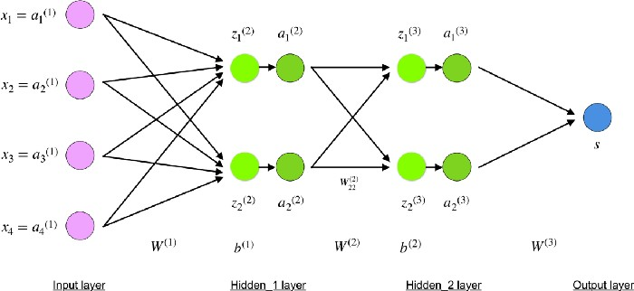
</p>
* W² and W³ are the weights in layer 2 and 3 while b² and b³ are the biases in those layers.
* The equation for input layer
<p align="center">
  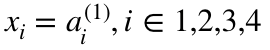
</p>
* The equation for layer 2
<p align="center">
  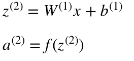
</p>
* The equation for layer 3
<p align="center">
  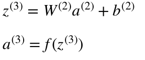
</p>
* Activations 'a' are computed using an activation function f (a non-linear func like sigmoid, ReLU, tanh).
* Looking carefully, you can see that all of x, z², a², z³, a³, W¹, W², b¹ and b² are missing their subscripts presented in the 4-layer network illustration above. The reason is that we have combined all parameter values in matrices, grouped by layers.
* Take for example layer-2:
	- W¹ is a weight matrix of shape (n, m) where n is the number of output neurons (neurons in the next layer) and m is the number of input neurons (neurons in the previous layer). For us, n = 2 and m = 4.
<p align="center">
  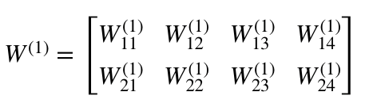
</p>
<p align="center">
  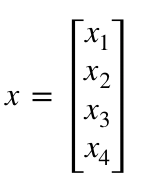
</p>
<p align="center">
  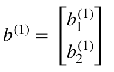
</p>
<p align="center">
  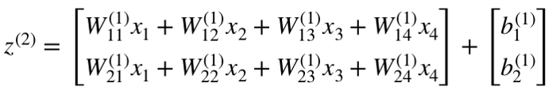
</p>
* Now carefully observe the neural network illustration from above
<p align="center">
  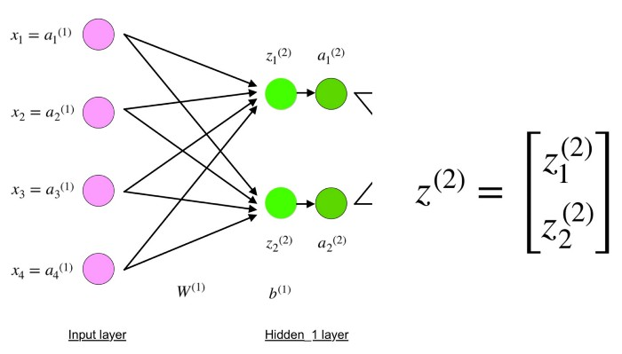
</p>
* You will see that z² can be expressed using (z_1)² and (z_2)² where (z_1)² and (z_2)² are the sums of the multiplication between every input x_i with the corresponding weight (W_ij)¹
* The final part of a neural network is the output layer which produces the predicated value. 
<p align="center">
  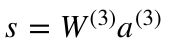
</p>
* Overview of forward propagation equation
<p align="center">
  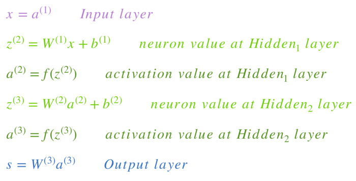
</p>
* The final step in a forward pass is to evaluate the predicted output s against an expected output y.
* The output y is part of the training dataset (x, y) where x is the input (as we saw in the previous section).
* Evaluation between s and y happens through a cost function. This can be as simple as MSE (mean squared error) or more complex like cross-entropy.
* We name this cost function C and denote it as follows:
<p align="center">
  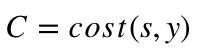
</p>
	- where, cost can be equal to [MSE](https://en.wikipedia.org/wiki/Mean_squared_error), [cross-entropy](http://neuralnetworksanddeeplearning.com/chap3.html) or [any other cost function](https://stats.stackexchange.com/questions/154879/a-list-of-cost-functions-used-in-neural-networks-alongside-applications).
* Based on C’s value, the model “knows” how much to adjust its parameters in order to get closer to the expected output y. This happens using the backpropagation algorithm.
* According to the paper from 1989, backpropagation:

> repeatedly adjusts the weights of the connections in the network so as to minimize a measure of the difference between the actual output vector of the net and the desired output vector.

and

> the ability to create useful new features distinguishes back-propagation from earlier, simpler methods…

* In other words, backpropagation aims to minimize the cost function by adjusting network’s weights and biases.

## References
* https://www.datacamp.com/community/tutorials/deep-learning-python
* [sigmoid unit in neural networks](https://www.youtube.com/watch?v=9IwbALQ9kdY)
* [A Gentle Introduction to the Rectified Linear Unit (ReLU)](https://machinelearningmastery.com/rectified-linear-activation-function-for-deep-learning-neural-networks/)
* [What is hidden layer](https://deepai.org/machine-learning-glossary-and-terms/hidden-layer-machine-learning)
* [Understanding neural networks](https://medium.com/fintechexplained/understanding-neural-networks-98e94251fb97)
* [Bias and Weights](https://medium.com/fintechexplained/neural-networks-bias-and-weights-10b53e6285da)
* [Neural Network Layers](https://medium.com/fintechexplained/neural-network-layers-75e48d71f392)
* [Understanding Neural Network Neurons](https://medium.com/fintechexplained/understanding-neural-network-neurons-55e0ddfa87c6)
* [Neural Network Activation Function Types](https://medium.com/fintechexplained/neural-network-activation-function-types-a85963035196)
* [What are Hidden layers](https://medium.com/fintechexplained/what-are-hidden-layers-4f54f7328263)
* [How Many Hidden Layers/Neurons to Use in Artificial Neural Networks?](https://towardsdatascience.com/beginners-ask-how-many-hidden-layers-neurons-to-use-in-artificial-neural-networks-51466afa0d3e)
* [Activation Functions in Neural Networks](https://towardsdatascience.com/activation-functions-neural-networks-1cbd9f8d91d6)
* [Understanding the Motivation of Sigmoid Output Units](https://towardsdatascience.com/understanding-the-motivation-of-sigmoid-output-units-e2c560d4b2c4)