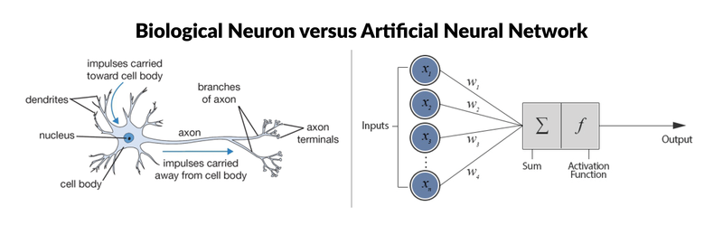
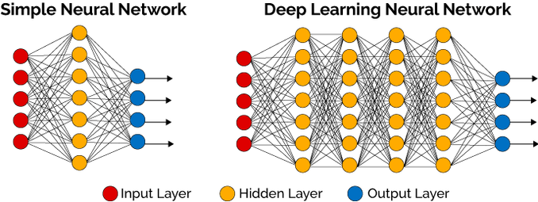

# Foundation of Deep Learning
## Basics
> Artificial Neural Networks Are Inspired By Biological Neural Networks

* Biological neuron vs ANN
<p align="center">
  
</p>

* each input node can be any numerical value i.e. real no., can be +ve or -ve, whole or decimal nos.
* weight can be any real no.
* weighted sum is the input of activation function
```
f(sum(Xi * Wi))
```

### Hidden layer
* A neural network looks like this:
<p align="center">
  
</p>
* located b/w input & output
* where the function applies weights to the inputs and directs them through an activation function as the output.
* perform non-linear transformations of the inputs.
* Hidden layer(s) can be of any no. & it depends on 
	- the purpose/objective of the neural network.
	- associated weights
* hidden layers in simple vs deep neural network
<p align="center">
  
</p>
* Hidden layers consist of activation function(s) which are mathematical & the intended output is between 0 & 1, the range for defining probability.

### Activation function
* Activation functions are Sigmoid, Hyperbolic tangent, ReLU.
* Sigmoid function
<p align="center">
  
</p>

* rectified linear activation function or __ReLU__ for short is a piecewise linear function that will output the input directly if it is positive, otherwise, it will output zero. It has become the default activation function for many types of neural networks because a model that uses it is easier to train and often achieves better performance. There are more reasons:
	- As the sigmoid & hyperbolic tangent functions have "vanishing gradient problem", which is not there in ReLU.
* ReLU is the default activation in case of multilayer perceptron & CNNs.


## References
* https://www.datacamp.com/community/tutorials/deep-learning-python
* [sigmoid unit in neural networks](https://www.youtube.com/watch?v=9IwbALQ9kdY)
* [A Gentle Introduction to the Rectified Linear Unit (ReLU)](https://machinelearningmastery.com/rectified-linear-activation-function-for-deep-learning-neural-networks/)
* [Activation Functions in Neural Networks](https://towardsdatascience.com/activation-functions-neural-networks-1cbd9f8d91d6)
* []