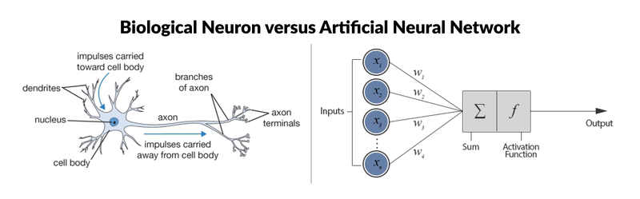
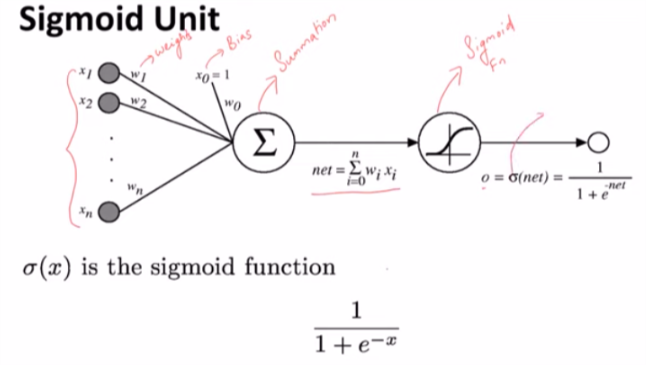

# Keras
## Basics
* Biological neuron vs ANN
<p align="center">
  
</p>

* each input node can be any numerical value i.e. real no., can be +ve or -ve, whole or decimal nos.
* weight can be any real no.
* weighted sum is the input of activation function
```
f(sum(Xi * Wi))
```

### Activation function
* Activation function can be sigmoid function
<p align="center">
  
</p>

* rectified linear activation function or __ReLU__ for short is a piecewise linear function that will output the input directly if it is positive, otherwise, it will output zero. It has become the default activation function for many types of neural networks because a model that uses it is easier to train and often achieves better performance.

## References
* https://www.datacamp.com/community/tutorials/deep-learning-python
* [sigmoid unit in neural networks](https://www.youtube.com/watch?v=9IwbALQ9kdY)
* [A Gentle Introduction to the Rectified Linear Unit (ReLU)](https://machinelearningmastery.com/rectified-linear-activation-function-for-deep-learning-neural-networks/)
* [Activation Functions in Neural Networks](https://towardsdatascience.com/activation-functions-neural-networks-1cbd9f8d91d6)
* []