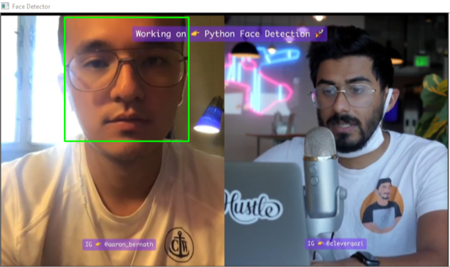
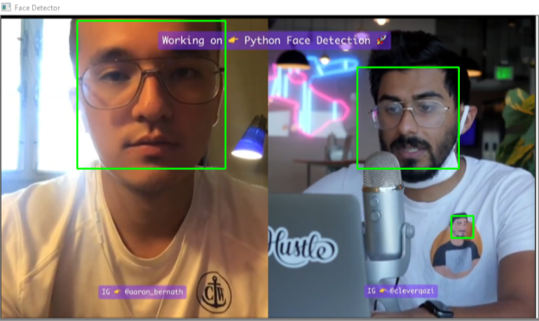
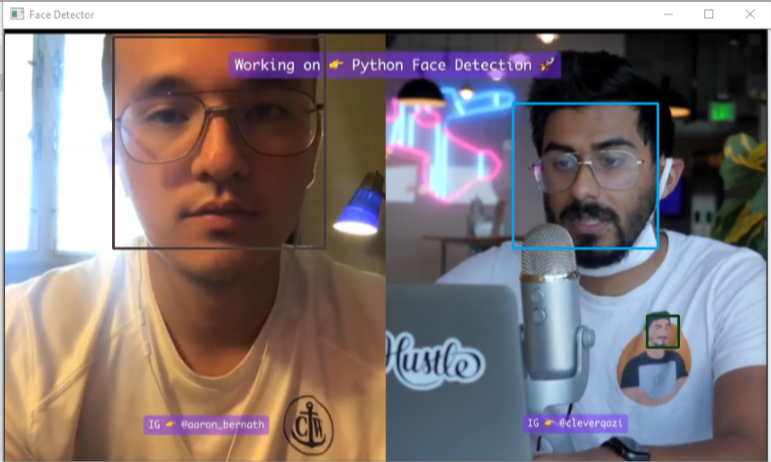
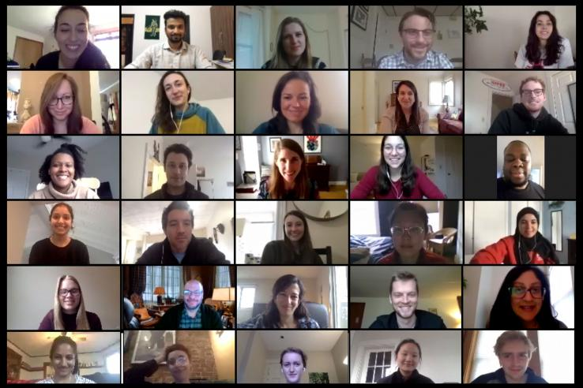
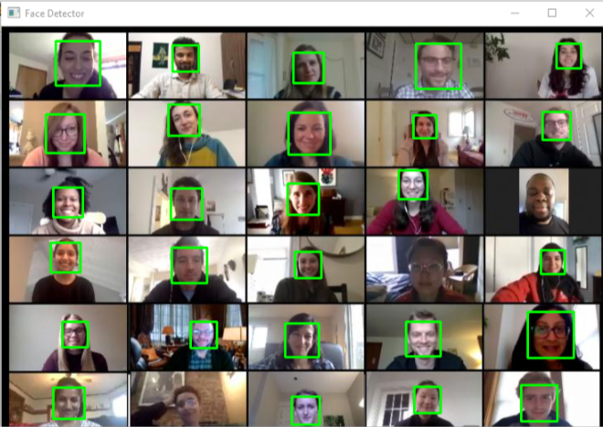
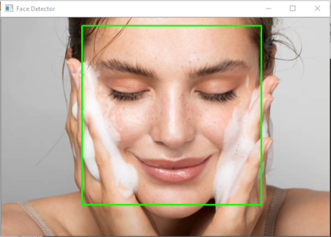

# Face Detector App

## Key points
* The computer looks in Black/White i.e. grayscale.
* So, convert all the coloured images into gray scale.
* Steps:
	- collect all data
	- convert to grayscale
	- train into the algorithm

## Demo
* Detect single face in "photo with multiple faces"
<p align="center">
	
</p>
	
	- code
```py
(x, y, w, h) = face_coordinates[0]
cv2.rectangle(img, (x, y), (x+w, y+h), (0, 255, 0), 2)
```
* Detect multiple faces in "photo with multiple faces"
<p align="center">
	
</p>
	
	- code
```py
# detect multiple faces
# for i in range(len(face_coordinates)):
# 	x, y, w, h = face_coordinates[i];
# 	cv2.rectangle(img, (x, y), (x+w, y+h), (0, 255, 0), 2)

# OR

for x, y, w, h in face_coordinates:
	cv2.rectangle(img, (x, y), (x+w, y+h), (0, 255, 0), 2)
```

* Make different colors of rectangles based on the faces
<p align="center">
	
</p>
	- code
```py
for x, y, w, h in face_coordinates:
	cv2.rectangle(img, (x, y), (x+w, y+h), (randrange(256), randrange(256), randrange(256)), 2)  # random color
```
	- only bright color
```py
for x, y, w, h in face_coordinates:
	cv2.rectangle(img, (x, y), (x+w, y+h), (randrange(128, 256), randrange(128, 256), randrange(128, 256)), 2)  # random color
```
* Multiple faces detection
	- Input
<p align="center">
	
</p>
	- Code
```py
for x, y, w, h in face_coordinates:
	cv2.rectangle(img, (x, y), (x+w, y+h), (randrange(128, 256), randrange(128, 256), randrange(128, 256)), 2)  # random color
```
	- Output
<p align="center">
	
</p>
	- Here, as all the images are not detected, so this algorithm is not working best in Meeting calls.

* Detect image
	- Input
<p align="center">
	
</p>
	- Code
```py
for x, y, w, h in face_coordinates:
	cv2.rectangle(img, (x, y), (x+w, y+h), (0, 255, 0), 2)		# make the face green color
```
	- Output
<p align="center">
	
</p>


## References
* [Python Artificial Intelligence Tutorial - AI Full Course for Beginners in 9 Hours [2021]](https://www.youtube.com/watch?v=XIrOM9oP3pA)