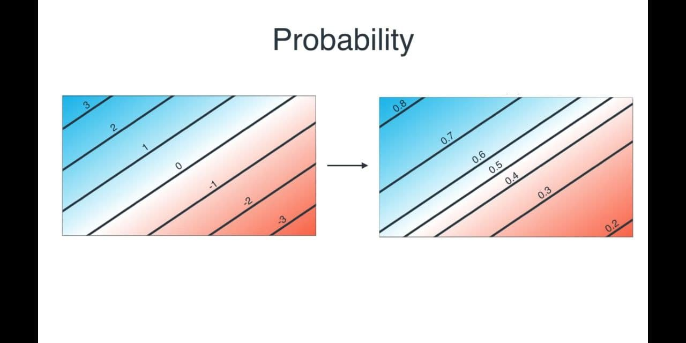

## Talks
### 1. [A friendly introduction to Deep Learning and Neural Networks](https://www.youtube.com/watch?v=BR9h47Jtqyw)
* Curriculum
	- [00:00 What is machine learning?](https://www.youtube.com/watch?v=BR9h47Jtqyw&t=0s)
	- [2:22 Gradient descent](https://www.youtube.com/watch?v=BR9h47Jtqyw&t=142s)
	- [5:07 Neural network](https://www.youtube.com/watch?v=BR9h47Jtqyw&t=307s)
	- [10:11 logistic regression](https://www.youtube.com/watch?v=BR9h47Jtqyw&t=748s)
	- [12:28 Probability](https://www.youtube.com/watch?v=BR9h47Jtqyw&t=748s)
	- [14:57 Activation Function](https://www.youtube.com/watch?v=BR9h47Jtqyw&t=897s)
	- [19:56 Error function](https://www.youtube.com/watch?v=BR9h47Jtqyw&t=1196s)
	- [22:34 Node(Neuron)](https://www.youtube.com/watch?v=BR9h47Jtqyw&t=1354s)
	- [24:07 Non-linear regions](https://www.youtube.com/watch?v=BR9h47Jtqyw&t=1447s)
	- [31:22 Deep neural network](https://www.youtube.com/watch?v=BR9h47Jtqyw&t=1882s)
* - Minimize param i.e. error
* Reduce the penalty & hence the error gets minimized & the line gets shifted to wrongly drawn to optimized drawn
<p align="center">
  
</p>

* A visual representation of Gradient descent with logistic regression
	- step-1
<p align="center">
  
</p>
	- step-2
<p align="center">
  
</p>
	- step-3
<p align="center">
  
</p>
* Here, the RHS is much more used as a probability 0 to 1.
```
P(red) = 0
P(blue) = 1
```
<p align="center">
  
</p>
* To reachout to RHS in previous image, activation function needs to be applied.
<p align="center">
  
</p>
* How to calculate error func.
	1. Multiply the probability of each point & get the highest value as the best case i.e. RHS image. Also called maximum likelihood.
	2. To convert product of things into Summation (for errors), use logarithm func.
	3. Decide i.e. lesser the value, lesser is the error func.
<p align="center">
  
</p>
* Convert into neuron prob.
<p align="center">
  
</p>
* Case-2: Non-linear region
<p align="center">
  
</p>
* Obtain the line using combination
<p align="center">
  
</p>
* The final curve line is obtained in this way:
	1. Add the probability of points in top & bottom image. 
	2. Now, 1.5 > 1, So, apply activation func to this.
	3. 0.82 obtained.
<p align="center">
  
</p>
* E.g. 1
	- for 2-D (x, y) in discrete func.
	- hidden layer's neurons
<p align="center">
  
</p>
* E.g. 3
	- for 3-D coordinates in discrete func.
<p align="center">
  
</p>
* E.g. 4
	- for 2-D (x, y) in discrete func.
	- Hidden layers increased
<p align="center">
  
</p>
* E.g. 5
	- 5 hidden layers
<p align="center">
  
</p>
* E.g. 6
	- Self driving car
<p align="center">
  
</p>

